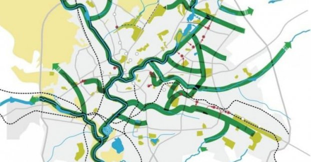

# Велоинфраструктура
Принципы (коротко):
1. Все основные магистрали из центра должны иметь велополосу или альтернативный параллельный маршрут (по второстепенным улицам или Зеленому каркассу).
2. Где есть возможность - строится отдельная дорожка с регулируемым пересечением с основной дорогой (пр. Московский, пр. Акад. Павлова, )
3. Минимум: наносим краской велополосу на дорогу по всем основным магистралям, при первой реконструкции - местро перераспределяется между пешеходы/вело/машины - чтобы по 1 м. в каждую стороны было для вело.
   1. **Магистрали из центра**
      1. Московский проспект.
      2. пр. Науки - ул. Ахсарова
      3. ул. Тринклера - ул. Сумская (с Парка Горького)
      4. ул. Конторская - ул. М. Гончаровская - пер. Кнышевский - ул. Полтавский Шлях (по тратуару) - пер. Полтавский - ул. Болобчана - Григоровское шоссе (через бор до речки).
         1. ул. Победителей - ул. Полтавский шлях (по тратуару) / ул. Залютинская
      5. Спуск Веснина - пер. Большой Даниловский 
      6. пр. Академика Павлова
      7. Новоивановский мост - Кузинский мост - Озерянская ул.
   2. **Соеденительные улицы**
      1. Плехановская
      2. ул. Деревянко
      3. ул. Новгородская
      4. ул. 23 августа
      5. ул. Героев Труда - ул. Саперная - ул. Рудика
      6. пр. Героев Сталинграда - пр. Александровский
   
4. **Зеленый каркасс** (какие магистрали дублируются)
   1. Основные
      1. ул. Клочковская (Лопань)
      2. ул. Шевченко (Харьков)
      3. Салтовское шоссе (Немышля)
      4. Гимназическая набережная (Стрелка/Нетеча)
   2. Неосновной:
      1. Москалевская - Караческое шоссе (Лопань)
      2. Свистуновкая - Кибальчика - Некрасова (Уды)
   3. Новый 
      1. р. Алексеевка (Лопань - Ахсарова)

5.  Съезды: Зеленый Каркасс - магистрали
    1.  стрелка Немышля-Харьков - пер. Большой Даниловский
    2.  Лопань - Московский проспект
    3.  Лопань - Новоивановский мост
    4.  Лопань - Новгородская
    5.  Лопань - 23 Августа
    6.  Харьков - ул. Геровев Труда
6. Перспективные дороги:
   1. ул. Пушкинская - ул. Саперная
   2. пер. Большой Даниловский - ул. Чайковская (обеспечить проход через лесницу)
7. Во всех зеленых зонах и широких тратуарах - размеченная вело-пешеходная дорожка.

 ## Изображения на которые опиарлся
Самая важная карта - показывает интенсивность движения по основным магистралям:  
     

 
      
   
     
  

     
   
 
 ## Ссылки
 1. [Общий архив исследований по вело](http://xt.ht/phpbb/viewtopic.php?f=24&t=200833&fbclid=IwAR2WTDK3sgcmB9f9O78aYh__953emMFUlGkEJiXsITfhePfQR6w2epw7nlQ)
 2. [Велоконцепция г. Харькова](http://kharkiv.rocks/reestr/653772?fbclid=IwAR1EP7U10QzhlCP_c7-64gnFJGhOHhvmugNoeSu3sctr69qxXK92kIFENbs)
 3. [Новость про зеленый каркасс](https://www.city.kharkov.ua/ru/news/igor-terekhov-rozpoviv-pro-proekt-zeleniy-karkas-47738.html)

 